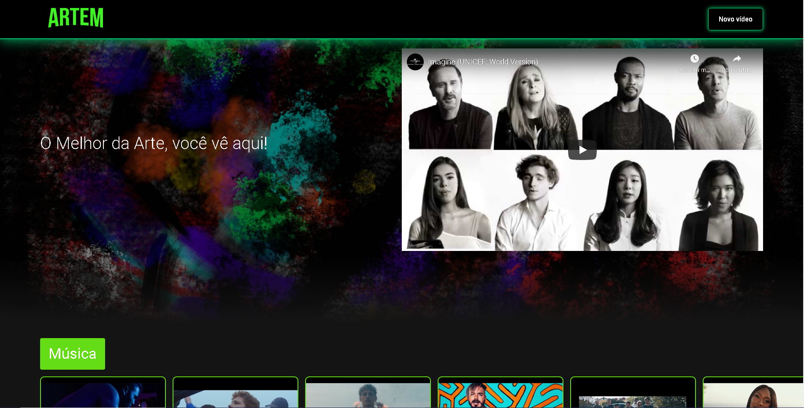

# CookBook 

## Aplicação React Baseada na Interface da Netflix




> Projeto construído durante a [Imersão React da Alura](https://www.alura.com.br/imersao-react/)


## Para Instalar

Após baixar o projeto, acesse ele via seu terminal e rode o comando:

```sh
npm install
```

## Para rodar o projeto:

```sh
npm start
```
## Projeto no ar

https://cook-book-git-category.jussarasoares.vercel.app/
